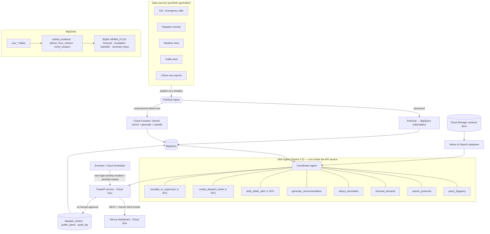

# Architecture

SENTINEL is an event-driven, agent-orchestrated platform on Google Cloud. Data flows from synthetic sources through a streaming bus into BigQuery, where it is unified, forecast, and scanned for anomalies. An ADK agent powered by Gemini reasons over that data — grounded in the city's protocols via RAG — and proposes explainable actions that a human approves before execution.

## System diagram



## Data flow

1. **Generate** — the synthetic generator publishes signals to per-type Pub/Sub topics. In `replay` mode it follows a scripted timeline so the demo unfolds in real time.
2. **Land** — structured signals stream straight into BigQuery via a Pub/Sub→BigQuery subscription. Unstructured citizen texts go through a Cloud Function that uses Gemini Flash to extract structured fields (type, severity estimate, entities, location) and writes them to BigQuery.
3. **Unify & enrich** — scheduled SQL builds `unified_incidents` (incidents + dispatch + nearest weather/traffic) and `district_hour_metrics` (counts, response times, unit availability).
4. **Predict & detect** — BQML `ARIMA_PLUS` forecasts demand per district/hour; an escalation classifier scores active clusters; statistical + clustering logic populates `event_clusters` and `anomaly_flags`.
5. **Reason** — the ADK agent answers questions and forms recommendations by calling its read tools, grounding rationale in protocols retrieved from Vertex AI Search.
6. **Act (with a human)** — write tools are gated: the agent emits a *proposed action*; the coordinator approves/edits/denies in the UI; on approval the API executes the tool and records the decision in `audit_log`.

## Service mapping

| Concern | GCP service | Notes |
|---|---|---|
| Reasoning / NL | Vertex AI — Gemini 2.5 Pro/Flash | Pro for Q&A & recommendations; Flash for cheap text extraction & classification |
| Data warehouse | BigQuery | Raw + curated + BQML + governance tables |
| Forecasting | BigQuery ML `ARIMA_PLUS` | Volume per district/hour, in-warehouse |
| Escalation prediction | BigQuery ML (boosted trees / logistic reg) | `ML.EXPLAIN_PREDICT` gives feature attributions for the evidence trail |
| RAG grounding | Vertex AI Search | Datastore over protocol PDFs/markdown in GCS |
| Agent orchestration | Agent Development Kit (ADK) | Python; defines agent, tools, and the HITL gate |
| Ingestion bus | Pub/Sub | One topic per signal type |
| Unstructured enrichment | Cloud Functions (2nd gen) | Gemini-powered field extraction |
| Event triggers | Eventarc + Cloud Scheduler | New high-severity incident → agent eval; scheduled forecast/anomaly refresh |
| Serving (API + agent) | Cloud Run service | FastAPI wrapping the ADK agent |
| Serving (dashboard) | Cloud Run service | Next.js |
| Data generator | Cloud Run Job | `seed` (batch) + `replay` (timed) modes |
| Situational map BI (optional) | Looker Studio | Free, BigQuery-backed bonus panel |
| CI/CD | Cloud Build + Artifact Registry | Triggered from GitHub `main` |
| Secrets / identity | Secret Manager + IAM | One least-privilege service account per service |

## Agent design

A single **coordinator agent** with a tool belt split into two classes:

- **Read tools** (`query_bigquery`, `search_protocols`, `forecast_demand`, `detect_anomalies`) run freely to gather evidence.
- **Action tools** (`draft_public_alert`, `create_dispatch_ticket`, `escalate_to_supervisor`) are **never executed by the agent directly** — it emits a proposed action that requires explicit human approval.

Every recommendation is a structured object so the UI can render explainability directly:

```jsonc
{
  "title": "Pre-position 2 medical units to North District",
  "action_type": "dispatch_recommendation",
  "confidence": 0.82,
  "rationale": "Cluster of 5 correlated reports plus a forecast showing demand exceeding available units within ~40 minutes.",
  "evidence": [
    {"source": "anomaly",   "detail": "Incident rate 4.1σ above baseline", "ref": "/anomalies/abc"},
    {"source": "forecast",  "detail": "7 calls predicted next hour vs 3 units free", "ref": "/forecast/north"},
    {"source": "protocol",  "detail": "Hazmat SOP §3.2", "ref": "rag://hazmat-sop#3.2"}
  ],
  "requires_human_approval": true
}
```

## Security & identity

- One service account per Cloud Run service, least privilege (API SA: BigQuery + Vertex AI + Pub/Sub publish; web SA: invoke API only).
- Secrets in Secret Manager; no credentials in source.
- Synthetic, PII-free data throughout.
