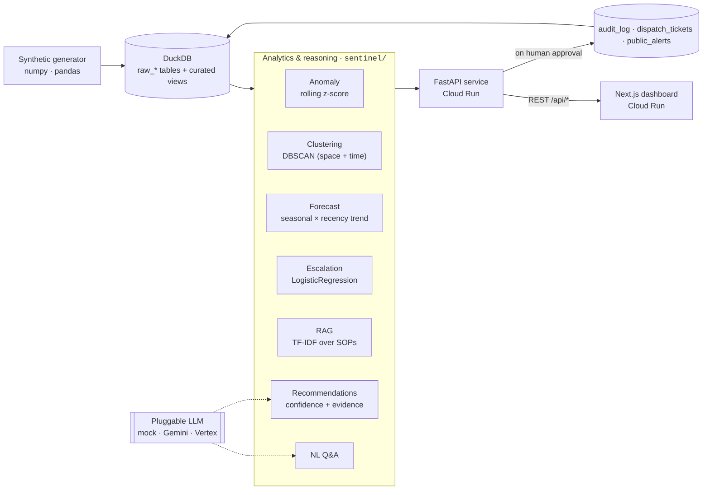

# 🛡️ SENTINEL — Public Safety Decision Intelligence Platform

> **S**ituational **E**vent i**NTEL**ligence — one live picture from many fragmented signals.

SENTINEL fuses 911, dispatch, weather, traffic, and citizen-report streams into a single situational picture, **predicts** where demand and escalation are heading, and **acts** — drafting public alerts, opening dispatch tickets, escalating to supervisors — with a **confidence score**, an **evidence trail**, and a **human approving** every high-stakes move.

Built for the **Google Cloud GenAI Hackathon (APAC)** · Problem area: *Public Safety & Emergency Preparedness*.

<p>
  
  
  
  
  
  
  
</p>

**🟢 Status:** Built, validated, and **live on Google Cloud Run**.
**🔎 API health:** [`/api/health`](https://sentinel-api-245103222760.us-central1.run.app/api/health) → returns the active LLM provider + incident count.

---

## The problem

A city emergency-operations coordinator watches signals pour in from many systems — 911 calls, dispatch records, weather, traffic, and citizen reports — **fragmented across tools and arriving faster than any human can synthesize**. Under time pressure they must decide, in near real time:

- **Where** to allocate limited responders
- **Which** incidents are escalating
- **When** to issue a public alert

Today that means manual cross-referencing and gut instinct. SENTINEL turns the fragmented stream into faster, better-informed, **explainable** decisions — and never removes the human from the loop.

---

## What it does — six capabilities

| # | Capability | How SENTINEL delivers it |
|---|------------|--------------------------|
| 1 | **Unify** structured + unstructured signals | All sources land in one warehouse; a `unified_incidents` view joins incidents ⋈ dispatch ⋈ weather ⋈ traffic; citizen texts sit alongside as an early-warning channel |
| 2 | **Answer** in natural language | Grounded Q&A over live operational data + the city's own protocols — deterministic offline, or Gemini when a key is present |
| 3 | **Detect** patterns & anomalies | Rolling **z-score** volume anomalies + **spatio-temporal DBSCAN** clustering → *"one developing event,"* not five unrelated calls |
| 4 | **Predict** outcomes | Per-district **demand forecast** (seasonal baseline × recency trend) + an **escalation classifier** (logistic regression) with feature attributions |
| 5 | **Recommend**, explainably | Every recommendation carries a **confidence score** and an **evidence trail** citing the exact protocol that justifies it |
| 6 | **Automate** with a human in the loop | The system *proposes* actions (alert draft · dispatch ticket · supervisor escalation); a human **approves/denies**, and every decision is written to an immutable **audit log** |

The three judged pillars — **prediction**, **automation**, and **responsible / explainable AI** — are first-class throughout.

---

## Architecture (as shipped)



**Runtime flow:** `generate → DuckDB → analytics modules → FastAPI → Next.js`. The dashboard reaches the API through a **runtime Next.js route handler** (`app/api/[...path]/route.js`, `force-dynamic`) that reads `API_URL` per request — so the same image works locally (`127.0.0.1:8000`) and in the cloud without a rebuild.

Full data-flow, agent design, and service mapping: [`ARCHITECTURE.md`](ARCHITECTURE.md).

---

## Under the hood — how each signal is computed

| Module | File | Technique | Notes |
|--------|------|-----------|-------|
| **Anomaly** | `sentinel/anomaly.py` | Rolling **z-score** vs. trailing 168-hour baseline (SQL window) | Latest-hour spike detection per district |
| **Clustering** | `sentinel/clustering.py` | **DBSCAN** over local-km coordinates + a scaled time axis | Fuses incidents *and* citizen texts into one "developing event" |
| **Forecast** | `sentinel/forecast.py` | Seasonal baseline `(dow, hour)` × recency-weighted trend | Baseline fit *excludes* the in-progress hour so a live surge isn't self-cancelling; emits demand-vs-capacity breach flags |
| **Escalation** | `sentinel/escalation.py` | **LogisticRegression** on type/priority/hour/wind/congestion | Exposes coefficients as feature attributions; reports held-out ROC-AUC |
| **RAG** | `sentinel/rag.py` | **TF-IDF + cosine similarity** over protocol markdown | Section-level chunking; every hit returns a `§`-citation |
| **Recommend** | `sentinel/recommend.py` | Composes all signals into scored, human-approvable actions | Templated alert text (no LLM on the hot poll path — keeps it fast & free) |
| **Q&A** | `sentinel/qa.py` | Grounded context pack + keyword-routed responder (+ Gemini when enabled) | Answers counts, busiest/quietest, response times, units, forecasts, summaries; clean off-topic fallback with suggestions |
| **Actions** | `sentinel/actions.py` | HITL approve/deny → tickets/alerts + **immutable audit log** | Evidence snapshot captured at decision time |
| **LLM** | `sentinel/llm.py` | Pluggable `mock` / `gemini` / `vertex` with graceful fallback | App is fully functional with **no API key** |

**Data model** (`data-generator/generate.py`) — synthetic but realistic: Poisson arrivals shaped by a diurnal curve, per-district incident-type mixes, wind/rain-correlated fire & hazmat, congestion-dependent response times, and a scripted **North-District gas-leak** "developing event" injected at the most recent timestamps so anomaly, clustering, forecast, and escalation all light up together for the demo.

**Curated views:** `unified_incidents` (incidents ⋈ dispatch ⋈ weather ⋈ traffic, with derived response times) and `district_hour_metrics` (per-district hourly counts, type breakdowns, priority-1 counts, avg response).

---

## API surface

`FastAPI` — `services/api/main.py`. All endpoints are JSON; the dashboard polls a subset live.

| Method | Endpoint | Purpose |
|--------|----------|---------|
| `GET`  | `/api/health` | Liveness + active LLM provider + incident count |
| `GET`  | `/api/overview` | KPIs, per-district status (anomaly/forecast/capacity), clusters, recent feed |
| `GET`  | `/api/forecast?district=&horizon=` | Demand forecast with confidence band + breach flag |
| `GET`  | `/api/anomalies` | Current-hour z-scores per district |
| `GET`  | `/api/clusters` | Developing-event clusters with members |
| `GET`  | `/api/incidents` · `/api/incidents/{id}` | Incident feed & detail |
| `GET`  | `/api/breakdowns` | Drill-down data behind each KPI tile |
| `GET`  | `/api/recommendations` | Explainable recommendations (confidence + evidence) |
| `POST` | `/api/recommendations/{id}/approve` · `/deny` | Human-in-the-loop decision |
| `GET`  | `/api/actions` | Audit log · dispatch tickets · public alerts |
| `POST` | `/api/ask` | Natural-language Q&A `{ answer, suggestions }` |
| `POST` | `/api/admin/reset` | Clear approvals/tickets/alerts (reset the demo) |

---

## Repository layout

```
gen_ai_sentinal/
├── sentinel/               # core package — analytics, ML, RAG, Q&A, actions, LLM
│   ├── config.py           #   districts, centroids, capacities, incident types
│   ├── db.py               #   DuckDB access layer (BigQuery stand-in)
│   ├── anomaly.py          #   rolling z-score volume anomalies
│   ├── clustering.py       #   spatio-temporal DBSCAN → developing events
│   ├── forecast.py         #   seasonal + recency-trend demand forecast
│   ├── escalation.py       #   logistic-regression escalation classifier
│   ├── rag.py              #   TF-IDF RAG over response protocols
│   ├── recommend.py        #   explainable, confidence-scored recommendations
│   ├── qa.py               #   grounded natural-language Q&A
│   ├── actions.py          #   HITL approve/deny + immutable audit log
│   └── llm.py              #   pluggable LLM: mock / Gemini / Vertex
├── services/
│   ├── api/                # FastAPI backend           → Cloud Run
│   └── web/                # Next.js situational dashboard → Cloud Run
├── data-generator/         # synthetic signal generator (+ scripted demo event)
├── rag/protocols/          # response-protocol SOPs (hazmat, medical, alerts, allocation)
├── Dockerfile              # API container (generates data at startup)
├── DEPLOY.md               # Cloud Run deploy walkthrough (Cloud Shell)
├── ARCHITECTURE.md         # data flow, agent design, service mapping
└── infra/ · bigquery/ · agent/ · functions/   # cloud-native evolution scaffolds
```

---

## Run it locally

**Prerequisites:** Python 3.11+ and Node.js 20+.

```bash
# 1. Python env + package
python -m venv .venv && . .venv/Scripts/activate      # Windows
#   or: source .venv/bin/activate                      # macOS/Linux
pip install -e .

# 2. Generate synthetic data (includes the demo "developing event")
python data-generator/generate.py --days 14 --db data/sentinel.duckdb

# 3. Start the API
uvicorn services.api.main:app --reload --port 8000

# 4. Start the dashboard (in a second terminal)
npm --prefix services/web install
npm --prefix services/web run dev            # http://localhost:3000
```

The dashboard talks to the API at `http://127.0.0.1:8000` by default. No API key, no cloud account, no external calls — the whole platform runs offline on the **mock** LLM.

---

## Deploy to Google Cloud Run

Two containers — the FastAPI agent API and the Next.js dashboard — deploy from **Cloud Shell**. The API image generates its own DuckDB (including the demo event) at startup, so the first deploy is fully self-contained.

```bash
gcloud run deploy sentinel-api --source . \
  --region us-central1 --allow-unauthenticated \
  --memory 1Gi --min-instances 1 --port 8080

API_URL=$(gcloud run services describe sentinel-api --region us-central1 --format='value(status.url)')

gcloud run deploy sentinel-web --source services/web \
  --region us-central1 --allow-unauthenticated \
  --set-env-vars API_URL=$API_URL --port 8080
```

Full walkthrough (API enablement, Gemini via Secret Manager, redeploy, demo reset): [`DEPLOY.md`](DEPLOY.md).

---

## The LLM is pluggable

Set `LLM_PROVIDER` — the app stays fully functional in every mode:

| `LLM_PROVIDER` | Behaviour | Needs |
|----------------|-----------|-------|
| `mock` *(default)* | Deterministic, offline, grounded answers + keyword-routed Q&A | nothing |
| `gemini` | Real Gemini via a Google AI Studio API key | `GEMINI_API_KEY` |
| `vertex` | Real Gemini via Vertex AI using the runtime service account | GCP project + Vertex API |

Both real providers **degrade gracefully**: on any generation error (quota, bad model, API disabled) they fall back to the grounded facts, so the user never sees an error. The current live deployment runs on `mock` — reliable, deterministic, and free.

---

## Responsible & explainable AI

- **Human-in-the-loop** on every high-stakes action — the system proposes, a human disposes.
- **Confidence + evidence** on every recommendation, including the **protocol citation** that justifies it.
- **Explainable predictions** — z-scores, forecast bands, and escalation feature attributions, not a black box.
- **Immutable audit log** capturing the evidence snapshot at each decision.
- **PII-free synthetic data** end to end.

---

## Cloud-native evolution path

Every module sits behind a clean interface, so the pragmatic, dependency-light build maps 1:1 onto managed Google Cloud services with no architectural change:

| Shipped (this repo) | → | Managed GCP target |
|---------------------|---|--------------------|
| DuckDB (`sentinel/db.py`) | → | **BigQuery** + **BigQuery ML** |
| Seasonal/trend forecast | → | **BigQuery ML** `ARIMA_PLUS` |
| TF-IDF RAG (`sentinel/rag.py`) | → | **Vertex AI Search** |
| Mock LLM | → | **Gemini** (Vertex AI) |
| In-container generator | → | **Pub/Sub** + **Cloud Functions** + **Eventarc** ingest |
| FastAPI + Next.js | → | **Cloud Run** *(already there)* |

The `infra/`, `bigquery/`, `agent/`, and `functions/` directories hold the scaffolding for that path.

---

## License

[MIT](LICENSE)
